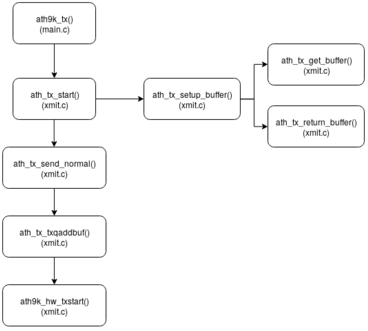

# `ath9k`

## Overview

The kernel network driver used throughout the project is `ath9k`. This page intends to provide an overview of the underlying logic of this driver. 

The source code of the `ath9k` driver can be found here at [Elixir Bootlin](https://elixir.bootlin.com/linux/latest/source/drivers/net/wireless/ath/ath9k).

## Transmission

In this driver, there exists a linked list of empty packet nodes (`tx_buf`), where each node is a C `struct` containing space to record the information of one to-be-transmitted packet. 

When `ath9k` receives a request to send a packet, it tries to obtain (pop) an empty node from the linked list buffer (`tx_buf`), fill in the packet information into the node, and then pass this node to a transmission routine by appending it to a transmission queue. After the transmission is finished, the node is emptied and gets added back to the buffer. Since the linked list buffer has a limited size (which can be obtained using the `ATH_TXBUF` macro) and each transmission temporarily pops one of its node, the linked list can be empty under high volumn of transmission demand. In such case, a packet is dropped thus cannot be transmitted.

This linked list is directly obtained from the private (`priv`) field of the hardware that the driver controls (of type `ieee80211_hw`), which is of type `ath_softc` and is usually named `sc`. Then `sc` along with other arguments are passed to buffer setup rountines (`ath_tx_setup_buffer`), which tries to obtain a buffer node using routine `ath_tx_get_buffer`. In particular, `sc` has a field `tx` of type `ath_tx` which contains buffer linked list called `txbuf`, and the routine `ath_tx_get_buffer` will try to pop a node from `txbuf` and return it to the calling routines.

    

