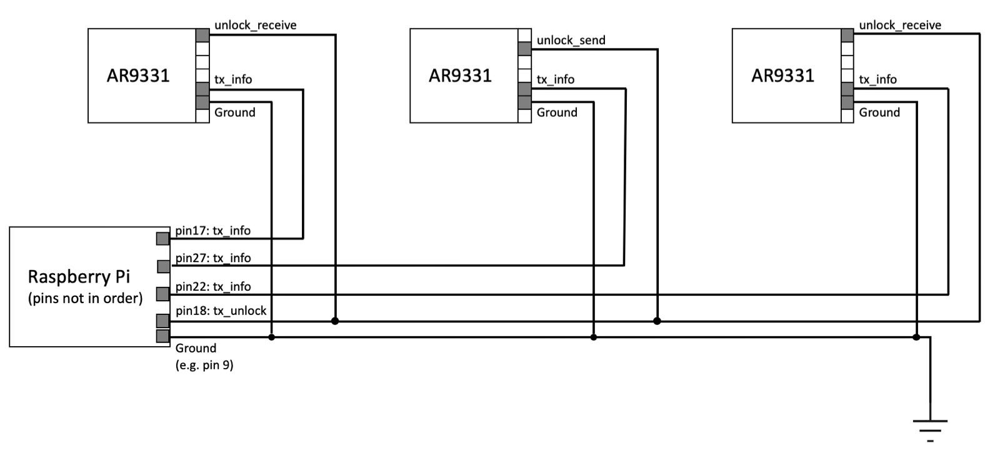

# RPi GPIO & TX Timeline

## Overview

It is important to keep track of the transmission timeline of the nodes while conducting experiments, which provides info of the finish times of packet transmissions. In the current setup, all nodes connect to a Raspberry Pi via GPIO and send a GPIO pulse once a packet has finished transmission (at `TX_OK` interrupts); the RPi then generates transmission timeslines for the nodes. 

## Getting started

### Compiling

1. Clone the repo [here](https://github.com/UCSMA-Project/ucsma-raspi-gpio).

2. Run `make` at the project root directory. 

### Common issues during compilation

#### Kernel headers for running kernel version does not exist

**Error message**
```bash
make: *** /lib/modules/$(uname -r)/build: No such file or directory.  Stop.
make: *** [all] Error 2
```

**Resolution**

This is becuase your recent `rpi-update` updated the firmware to a version with a "too-new" kernel version, and command `apt-get install raspberrypi-kernel-headers` installs an older kernel header. 

You need to first look into the `/lib/modules` directory and find which version has the correct, full kernel headers:
```bash
cd /lib/modules
find ./ -name build
```
then downgrade the firmware to the one with that kernel version with the `build` directory (in this example, version 5.10.63):
```bash
sudo rpi-update 64132d67d3e083076661628203a02d27bf13203c
```
*Note that the hash specifies the firmware version, which can be found here at: https://github.com/Hexxeh/rpi-firmware/commits.*

### Basic usage

1. Connect the nodes to the RPi via GPIO wires, e.g.:
<p align="center">
    
</p>

2. Load the monitoring kernel module
```bash
insmod gpio_timeline.ko
```

3. Start monitoring GPIO pulses 
```bash
# start capturing [frame count] frames' timeline data (e.g. 3000)
echo [frame count] > /sys/module/gpio_timeline/parameters/max_log_count
```

4. Read monitoring info sent to the kernel ring buffer with `dmesg`

### Generate TX timeline visualizations

The TX timeline data outputted to the kernel ring buffer is massive and unreadable. There is a [Python script](https://github.com/UCSMA-Project/TX_timeline_plotter) available that generates visualization from the data. 

1. Load the monitoring module in non-human-readable form to avoid overheads
```bash
insmod gpio_timeline.ko human_readable_output=0
```

2. [Optional] Switch the monitoring module to non-human-readable form to avoid overheads (if the module has already been loaded)
```bash
echo 0 > /sys/module/gpio_timeline/parameters/human_readable_output
```

3. Clear the currrent kernel ring buffer
```bash
dmesg -c
```

4. Start monitoring GPIO pulses 
```bash
# start capturing [frame count] frames' timeline data (e.g. 3000)
echo [frame count] > /sys/module/gpio_timeline/parameters/max_log_count
```

5. After a few seconds, save the timeline data in the kernel ring buffer to a file (e.g. `/tmp/data`)
```bash
dmesg -c > /tmp/data
```

6. Generate the visualization. Note that by default the script focuses on only the mid node and looks for `data.txt`, change those in the script if needed. 
```bash
python draw.py
```
